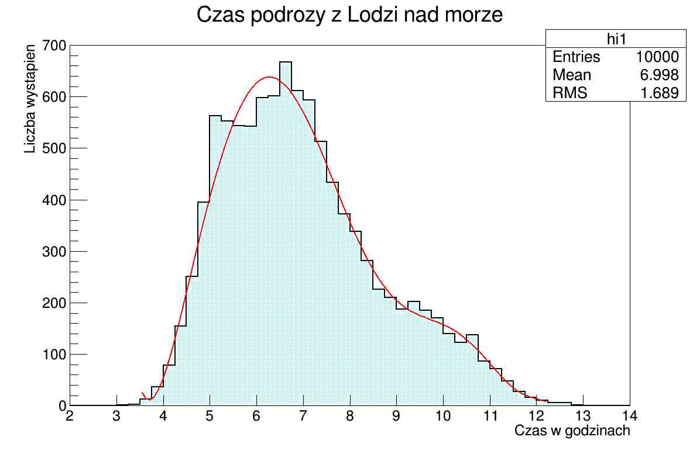

# Symulacja czasu dojazdu z Łodzi nad morze

## Opis symulacji
Program symuluje czas podróży z Łodzi do trzech nadmorskich miast: Kołobrzegu, Gdańska i Świnoujścia. Uwzględniono trzy środki transportu: samochód, pociąg oraz autobus. Czas podróży jest generowany na podstawie odpowiednich rozkładów statystycznych.

## Etapy symulacji

### Etap 1: Wybór środka transportu
Program losuje, jakim środkiem transportu podróż zostanie odbyta, zgodnie z poniższymi prawdopodobieństwami:
- **Samochód** - 60%
- **Pociąg** - 30%
- **Autobus** - 10%

### Etap 2: Wybór docelowego miasta
Losowanie miasta docelowego odbywa się według następującej dyskretnej dystrybucji:
- **Kołobrzeg** - 30%
- **Gdańsk** - 50%
- **Świnoujście** - 20%

### Etap 3: Symulacja czasu podróży samochodem
- Obliczany jest czas podróży zgodnie z normalnym rozkładem statystycznym.
- Liczba przerw w podróży jest losowana z rozkładu Poissona.
- Każda przerwa generuje dodatkowy czas podróży zgodnie z normalnym rozkładem statystycznym.

### Etap 4: Symulacja czasu podróży pociągiem
Obliczane są trzy segmenty czasu podróży, każdy z nich modelowany normalnym rozkładem statystycznym:
- **Czas dojazdu na dworzec**
- **Czas przejazdu pociągiem**
- **Czas dojazdu z dworca**

### Etap 5: Symulacja czasu podróży autobusem
Podobnie jak w przypadku pociągu, obliczane są trzy segmenty czasu podróży na podstawie normalnych rozkładów statystycznych:
- **Czas dojazdu na miejsce zbórki**
- **Czas przejazdu autobusem**
- **Czas dojazdu z miejsca zbórki**

### Etap 6: Zapis i analiza danych
- Wyniki symulacji zapisywane są do pliku.
- Na podstawie wyników tworzony jest wykres w ROOT'cie.
